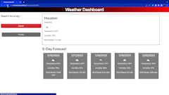

# Weather-Dashboard
## Description
An application that shows the current weather of a searched city along with a five day forecast

## Features
A search box that will serach for any city

Past searches will be stored and dispalyed at the bottom of search box

Current weather of the searched city will be displayed

A five day forecast will be displayed below the current weather

## Usage
* Open Link Url
* Click on Search Box
* Enter the city name of your choice
* Click the Submit button
* You can safely refresh or come back to the page after

## Links

* [Deployed Application URL](https://victorlmorales.github.io/Weather-Dashboard/)

## Application Demo

## License

This project is covered under the MIT License. (Refer to the LICENSE file)